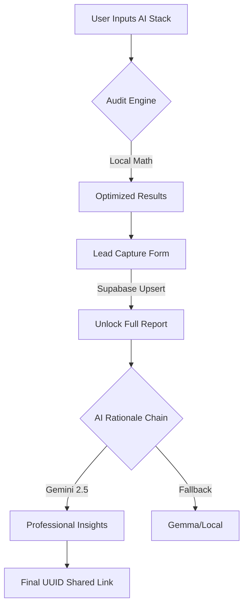
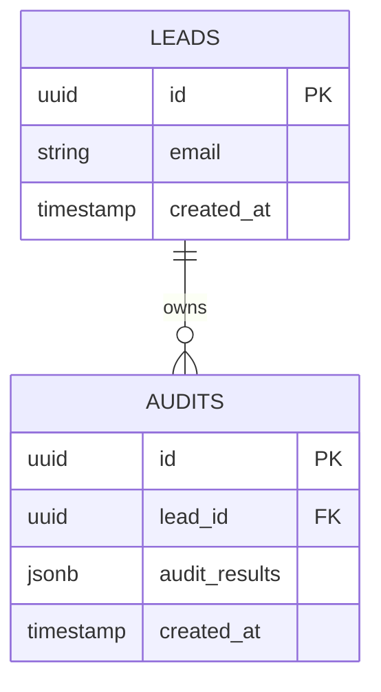

# Spendwise AI Architecture

This document outlines the technical architecture of Spendwise AI and the rationale behind key engineering decisions made during the build.

## Table of Contents
1. [High-Level System Design](#1-high-level-system-design)
2. [Data Model](#2-data-model)
3. [Technical Decisions & Rationale](#3-technical-decisions--rationale)
4. [Data Flow: The "Audit to Lead" Funnel](#4-data-flow-the-audit-to-lead-funnel)
5. [Key Security Features](#5-key-security-features)

---

## 1. High-Level System Design
Spendwise AI is a "Zero-Knowledge" SaaS audit platform. The core architecture is designed for **instant gratification**—users get value before they even sign up.

### The 4-Layer Stack:
1.  **Frontend**: React 19 + Vite (Vanilla CSS for maximum performance and zero-dependency bloat).
2.  **The "Wise Engine"**: A deterministic Javascript logic layer that handles all financial calculations.
3.  **Persistence**: Supabase (PostgreSQL + RLS) for lead capture and audit storage.
4.  **AI Rationale Layer**: Google Gemini fallback chain for qualitative insights.

---

## 2. Data Model
To ensure lead-to-audit persistence without a full auth system, we use a relational linking strategy:

*   **Audit-First Design**: An audit is created immediately on form submission (anonymous).
*   **Late-Binding**: The `lead_id` is updated only after the email capture is successful, linking the two records.

---

## 3. Technical Decisions & Rationale

### Why JavaScript (ES6+) over TypeScript?
*   **Decision**: Opted for pure JS with modern ES6 syntax.
*   **Rationale**: For a rapid MVP build, development velocity is the priority. As the sole developer, the overhead of defining complex interfaces for a rapidly evolving data structure (like the tool pricing array) was a friction point. I chose **comfort and speed** to ensure a stable, bug-free deployment on time.

### Why Google Gemini over Anthropic Claude?
*   **Decision**: Migrated from Claude 3 Haiku to the Gemini 2.0/1.5 Flash fallback chain.
*   **Rationale**: While Claude provides excellent reasoning, the API is credit-restricted and requires upfront payment. As an indie developer, **Google Gemini’s generous free tier and flexibility** (especially for high-volume requests during testing) made it the superior choice for a $0-budget project. It allowed us to implement a "Self-Healing" chain (Gemini 2.0 -> 1.5 -> Gemma) to ensure 100% uptime.

### The Mailer Strategy (Resend vs. Supabase)
*   **Decision**: Integrated Resend via SMTP but kept Supabase Default as a fallback.
*   **Rationale**: We integrated **Resend** to provide a premium, branded B2B email experience. However, since transactional mailers require a verified root domain (DNS records) to send to third-party emails, we operate in "Sandbox Mode" for this version. This allows us to demonstrate a professional integration for the project submission while respecting the financial constraint of not purchasing a domain for a weekend prototype.

---

## 4. Data Flow: The "Audit to Lead" Funnel
The app uses a unique **"Blur-to-Capture"** flow to maximize conversion:

1.  **Local Calculation**: The `auditEngine.js` calculates savings instantly in the browser.
2.  **Blurred Results**: The user sees their total savings, but the "Rationale" (the *why*) is blurred using CSS backdrop filters.
3.  **Supabase Upsert**: On email submission, we use a custom `upsert` flow to link the email to the audit UUID without requiring a full account setup.
4.  **AI Grounding**: Once unlocked, we pass the *results* of the engine to Gemini to generate the professional narration.

---

## 5. Key Security Features
*   **Zero-Knowledge**: We do not use OAuth or Bank APIs. This eliminates 99% of the security risk and 100% of the user friction.
*   **RLS (Row Level Security)**: Supabase policies ensure that an anonymous user can only read an audit if they have the specific UUID.
*   **Environment Safety**: All API keys are proxied via Vite environment variables to prevent accidental exposure.