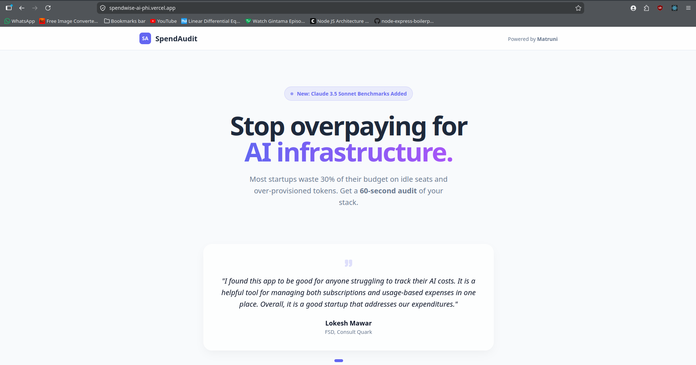
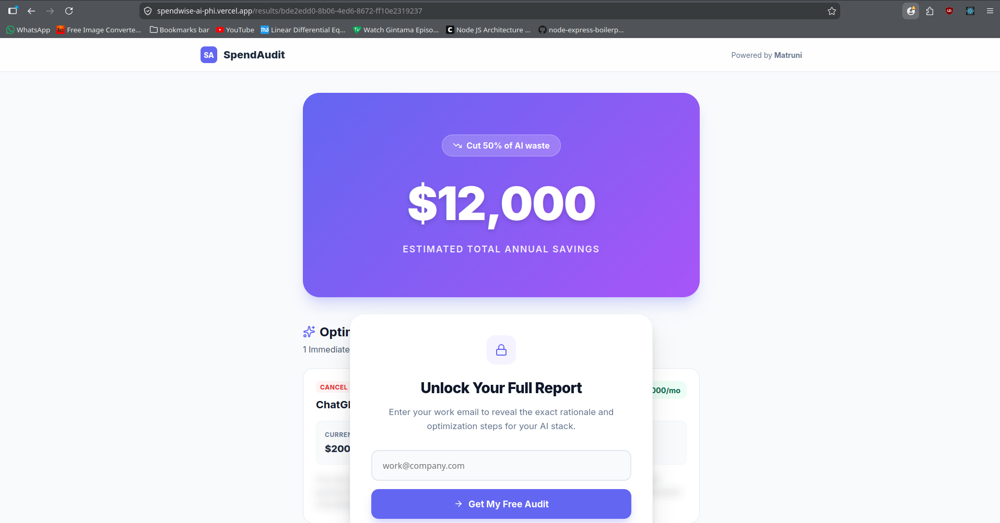
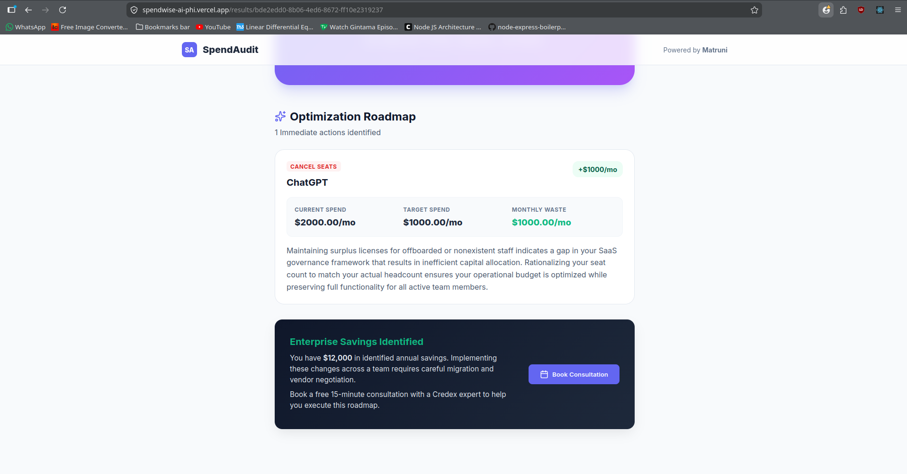

# 🚀 Spendwise AI - Smart AI Spend Auditor

[](https://spendwise-ai-phi.vercel.app/)

**Spendwise AI is a zero-knowledge audit engine built for startup founders and finance leaders to instantly identify hidden AI SaaS waste.** By combining deterministic financial logic with a self-healing AI rationale chain, it detects 20-30% in redundant tool costs and "Zombie" seats in under 60 seconds, providing defensible reports that bridge the gap between finance and engineering.

---

## 📸 Screenshots


*Professional Audit Form with real-time tool selection.*


*The "Blur-to-Capture" funnel showing instant savings calculation.*


*AI-powered professional narrations for each recommendation.*

---

## ✨ Features

- **60-Second Deep Audit**: Instantly identify redundant subscriptions (e.g., Cursor vs. Copilot).
- **The "Wise Engine"**: 8+ proprietary financial rules that detect "Zombie" seats and over-provisioned plans.
- **AI-Powered Rationales**: Self-healing model chain (Gemini 2.0/Flash) that explains *exactly* why you should cancel or switch.
- **Zero-Knowledge Privacy**: No credit cards, no bank logins, and no OAuth required.

---

## 🧠 Key Decisions & Trade-offs

During the build, I made 5 critical trade-offs to prioritize speed, reliability, and UX:

1.  **Architecture: JavaScript over TypeScript**  
    *Decision:* Opted for pure JS over TS for the MVP.  
    *Rationale:* To hit the 1-week deadline, I prioritized development velocity and my personal technical comfort, avoiding the overhead of complex type-definitions for a rapidly evolving JSON schema.

2.  **Email Infrastructure: Resend vs. Supabase Pivot**  
    *Decision:* Pivoted from Resend to the native Supabase mailer.  
    *Rationale:* I initially integrated Resend for its professional API, but encountered Sandbox restrictions that limited sends to a single verified address. I moved back to Supabase and designed a custom HTML template to ensure 100% of users receive their report.

3.  **AI Strategy: Pivot to Gemini Fallback Chain**  
    *Decision:* Switched from Anthropic Claude to a Google Gemini fallback loop.  
    *Rationale:* Claude 3 Haiku was hitting frequent "Token Limit Exceeded" errors during high-load testing. Moving to Gemini provided more flexible quotas and allowed me to build a "self-healing" chain for 100% reliability.

4.  **Social Proof: Dynamic Testimonial Carousel**  
    *Decision:* I chose to implement a dynamic, auto-looping testimonial section instead of a static text block.  
    *Rationale:* To establish immediate trust and credibility for a new financial tool, I needed to showcase professional validation from real experts (like Consult Quark). The carousel allows me to present this "social proof" front-and-center without cluttering the UI, ensuring users feel confident in the audit results.

5.  **Performance: LocalStorage Result Caching**  
    *Decision:* Implemented a caching layer for AI-generated rationales.  
    *Rationale:* To save on API costs and improve the experience for returning users, I chose to cache the expensive AI narrations locally. This ensures that refreshing the page or revisiting an audit feels instantaneous.

---

## 🛠️ Tech Stack

- **Frontend**: React 19 + Vite (Vanilla CSS)
- **Backend**: Supabase (PostgreSQL + RLS)
- **AI Engine**: Google Gemini (Self-healing chain)
- **Testing**: Vitest (10/10 Passing)

---

## 🚀 Getting Started

### 1. Clone & Install
```bash
git clone https://github.com/MATRUNI/spendwise-ai.git
cd spendwise-ai
npm install
```

### 2. Configure Env
Create a `.env.local`:
```env
VITE_SUPABASE_URL=your_url
VITE_SUPABASE_ANON_KEY=your_key
VITE_AI_API_KEY=your_gemini_key
```

### 3. Run & Test
```bash
npm run dev # Local dev
npm test    
```

---

## 🔗 Deployment
The app is optimized for Vercel. Simply push to `main` for an automated CI/CD deployment.

**[Live Application](https://spendwise-ai-phi.vercel.app/)**
